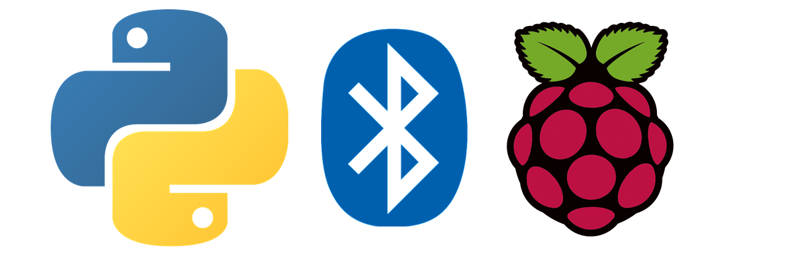

# PythonBluetoothServer

This repository contains support for writing Python programs to serve sockets over Bluetooth.  The code derives from
the term projects of four students in Washington and Lee's Spring 2018 course
<a href="https://home.wlu.edu/~levys/courses/csci251s2018/">CSCI 251: Android App Development</a>.  The students originally
wrote code to support controlling a servo on a RaspberryPi, with the control signal coming from a simple Android
app.  Eventually I was able to factor this Python code into an abstract Python
<a href="https://github.com/simondlevy/PythonBluetoothServer/blob/master/bluetooth_server.py">class</a>, with the
servo code implemented as a 
<a href="https://github.com/simondlevy/PythonBluetoothServer/blob/master/servo_server.py">sub-class</a>.

As a simple protocol, the server uses text messages delimited by a period ('.' character).   
For those without a Raspberry Pi or servo, a simple &ldquo;call and response&rdquo; 
<a href="https://github.com/simondlevy/PythonBluetoothServer/blob/master/lowhigh_server.py">example</a>
allows you to try out the code on an ordinary computer: your client sends period-delimited
messages containing strings representing the values 0 through 100 ('0.', '1.',
'2.', ..., '99.', '100.'), and the server sends back 'LOW.' for values below 50,
and 'HIGH.' for values above.  

I have tested this code on the following two platforms:

* RaspberryPi 3 (servo example and call-and-response example)
* Sony VAIO Pro running Ubuntu 14.04 (call-and-response example)

## Setup

On Ubuntu and other Debian-based OSs like Raspbian:

<pre>
sudo apt-get install bluetooth libbluetooth-dev
sudo python3 -m pip install pybluez
</pre>

On Raspberry Pi 3 you will also need to edit 
<b>/lib/systemd/system/bluetooth.service</b> and add <b>-C</b> after <b>bluetoothd</b>.  Then reboot.

On Raspberry Pi 3 we also found it necessary to run the server as root; for example:

<pre>
% sudo python3 lowhigh_server.py
</pre>

The <b>sudo</b> was not necessary on other computers.

## Android client app

The easiest way to try out this code is with the [Android client app](https://github.com/simondlevy/BluetoothClient)
that we developed to work with it.  This app uses the same simple protocol as the Python server, and has been
tested with the servo and call-and-response examples.
